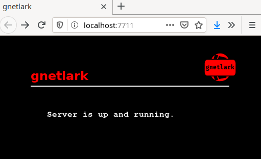
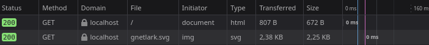

# 

[](http://godoc.org/github.com/xyproto/gnetlark) [](https://goreportcard.com/report/github.com/xyproto/gnetlark)

Fast HTTP server that supports handlers written in Starlark.

Pronounced as "jetlark", just to keep people on their toes.

### Features and limitations

* It's fast, due to the excellent performance of [gnet](https://github.com/panjf2000/gnet).
* Starlark is easy to learn and use. It is similar to Python.
* The selection of functions available from Starlark scripts is currently a bit limited. There is no file or database access.
* `gnetlark` offers an easy and fun way to try out the Starlark programming language.
* Support for providing and calling REST/JSON APIs might be added in the future.
* Serving static files is currently not supported, unless you embed them.

### Installation

Quick installation of the development version, using Go 1.17 or later:

    go install github.com/xyproto/gnetlark/cmd/gnetlark@latest

Another way of building and installing the server:

    git clone https://github.com/xyproto/gnetlark
    cd gnetlark/cmd/gnetlark
    go build
    sudo install -Dm755 gnetlark /usr/bin/gnetlark

### Configuration

One way to allow access to port 80 on Linux:

    sudo setcap cap_net_bind_service=+ep /usr/bin/gnetlark

It's also possible to specify a port with `--port` or run it as root (not recommended).

### Depends on

* [gnet](https://github.com/panjf2000/gnet), for serving HTTP.
* [starlark-go](https://github.com/google/starlark-go), for running Starlark scripts.

### Screenshot

Screenshot of a page served by [`index.star`](cmd/gnetlark/index.star), with the server running on port `7711`:



Served in 0ms:



### Example

A short Starlark script for handling requests and outputting "Hello, World!" ([`hello.star`](cmd/gnetlark/hello.star)):

```python
def index(status, msg, method, path, date):
    return "HTTP/1.1 " + status + "\r\nServer: gnetlark\r\nDate: " + date + "\r\nContent-Type: text/plain; charset=utf-8\r\n\r\n" + "Hello, World!"
```

The "Hello World" page can be served by a command like this:

    gnetlark -main hello.star -port 7711

## General info

* Version: 1.0.1
* Author: Alexander F. Rødseth &lt;xyproto@archlinux.org&gt;
* License: BSD-3
