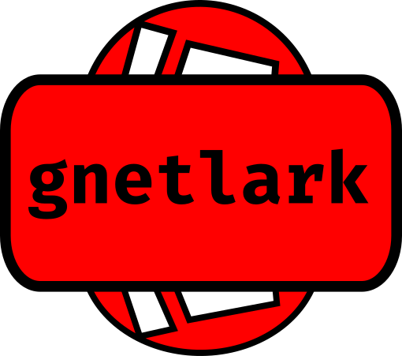

# gnetlark

A fast HTTP server that supports handlers written in Starlark.

Currently not very useful, but more like a technology demonstration.

### Installation

One way of building and installing

    git clone https://github.com/xyproto/gnetlark
    cd gnetlark
    go build
    sudo install -Dm755 gnetlark /usr/bin/gnetlark

### Configuration

One way to allow access to port 80 on Linux:

    sudo setcap cap_net_bind_service=+ep /usr/bin/gnetlark

It's also possible to specify a port with `--port` or run it as root (not recommended).

### Depends on

* [gnet](https://github.com/panjf2000/gnet), for serving HTTP
* [starlark-go](https://github.com/google/starlark-go), for running Starlark scripts

## General info

* Version: 0.0.1
* Author: Alexander F. Rødseth &lt;xyproto@archlinux.org&gt;
* License: MIT
